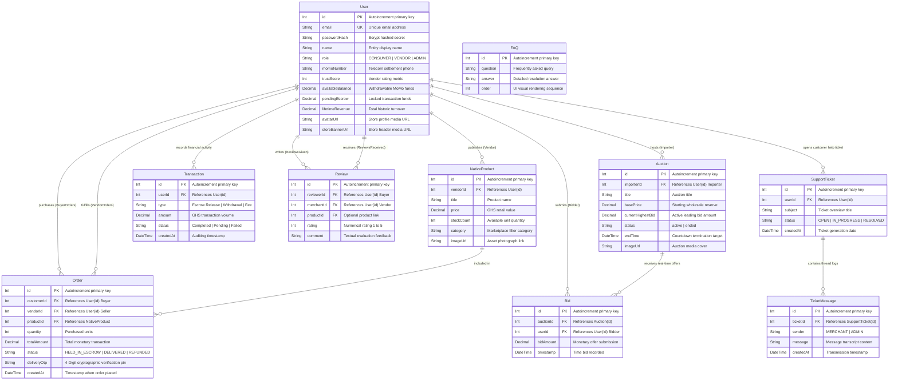

# BediDwa: Localized E-Commerce & Circular Auction Platform
### Complete Project Documentation & Technical Architecture Guide

---

## 1. The Problem & Executive Summary

### 1.1 The Real-World Problem in Regional E-Commerce
Across regional African retail markets—particularly in Ghana and West Africa—the burgeoning e-commerce landscape faces severe structural barriers that stifle digital economic growth:
1. **The Trust Deficit & P2P Fraud:** A majority of digital trade occurs informally over peer-to-peer messaging platforms such as WhatsApp, Instagram, and Facebook Marketplace. In these unmonitored spaces, transactions operate on extreme friction: buyers face a massive risk of sending upfront payment via mobile wallets only to be scammed with non-delivery or counterfeit items. Conversely, vendors who deliver goods prior to payment routinely face rejection at the doorstep, incurring wasted logistics and courier fees.
2. **Payment Gateway & Banking Exclusion:** International e-commerce giants and Western payment gateways (e.g., Stripe, PayPal, Visa, Mastercard) rely on traditional bank-issued credit cards and foreign merchant account structures. This directly alienates local retail markets where digital transactions are overwhelmingly fueled by regional **Mobile Money (MoMo)** telecom ecosystems.
3. **Prohibitive Import Overhead:** When consumers attempt to purchase high-value electronics, professional tools, or certified refurbished technology from overseas platforms, single-item import logistics create exorbitant shipping costs, complex customs tariffs, and weeks of unpredictable port clearing delays.

### 1.2 The BediDwa Solution
**BediDwa** is a localized, high-performance e-commerce and circular auction ecosystem designed from the ground up to solve these structural challenges. By bridging premium digital retail with localized fintech infrastructures, BediDwa establishes a zero-fraud trading engine powered by three foundational innovations:

* **Native Telecom MoMo Integration:** BediDwa operates natively within local telecom frameworks (**MTN MoMo, Telecel Cash, and AT Money**), completely bypassing credit card barriers and allowing instant digital wallet settlements.
* **The Delivery OTP Escrow System:** To totally eradicate social commerce fraud, BediDwa implements an automated, stateful Escrow framework. When a buyer makes a purchase, funds are instantly transferred into a secure internal escrow vault rather than directly to the seller. Release of these funds is cryptographically governed by a **4-Digit Delivery OTP (One-Time Password)** held exclusively by the buyer. Only upon physical parcel inspection and buyer satisfaction is the OTP handed over to the vendor or dispatch rider—triggering an immediate, atomic release of escrowed funds to the merchant's withdrawable balance.
* **The Dual-Catalog Architecture:**
  * *The Native Store:* A standard fixed-price retail environment for regionally produced goods, provisions, artisanal works (e.g., authentic Ashanti Silk Kente, raw botanicals), and local electronics. Because inventory is stored domestically, delivery occurs within hours without import customs friction.
  * *The Wholesale Circular Auction Engine:* A real-time competitive bidding marketplace for high-value imported tech and refurbished professional equipment. By consolidating regional demand into pooled bulk import lots, BediDwa drastically cuts per-unit shipping and customs expenses. Verified Importers set hidden wholesale reserve prices, and consumers bid in real-time—allowing buyers to win premium hardware well below standard retail prices while guaranteeing vendors instantaneous stock turnover and profit liquidation.

---

### 1.3 Core User Roles
BediDwa employs strict Role-Based Access Control (RBAC) to tailor functionalities and interface permissions across three distinct operational roles:

```
+-------------------+      +-----------------------+      +-----------------------+
|  CUSTOMER (BUYER) |      |   VENDOR (IMPORTER)   |      | SYSTEM ADMIN (ROOT)   |
+-------------------+      +-----------------------+      +-----------------------+
| • Browse catalog  |      | • Merchant Portal     |      | • Secret /hidden-xyz  |
| • Guest/User Cart |      | • Upload inventory    |      | • Relational CRUD     |
| • MoMo Checkout   |      | • Live Auction engine |      | • Global Escrow matrix|
| • Holds OTP Key   |      | • Escrow release      |      | • Dispute override    |
| • Live Room Bidder|      | • MoMo Withdrawals    |      | • Trust score audit   |
+-------------------+      +-----------------------+      +-----------------------+
```

* **Customer (Consumer / Buyer):** The regular marketplace participant. Customers can explore dynamic product catalogs, maintain persistent guest shopping carts, place instant MoMo escrow orders, participate in real-time interactive auction rooms, review seller trust scores, and manage their personal Delivery OTP keys.
* **Vendor (Merchant / Importer):** Verified sellers operating storefronts within BediDwa. Vendors unlock access to an isolated back-office Merchant Portal where they manage fixed-price product inventories, upload high-resolution asset images, schedule real-time container auctions, audit escrow balances, verify delivery OTPs, and process withdrawals directly to their commercial mobile money numbers.
* **System Admin (Root Authority):** The supreme administrative and regulatory authority of the platform. Segregated behind an obfuscated login ingress, the Admin exercises universal CRUD capabilities over all database entities, supervises real-time global order and escrow matrices, arbitrates dispute overrides, moderates vendor role permissions, and monitors system-wide financial integrity.

---

## 2. Functional User Manual (Step-by-Step Guide)

This section details the operational workflows of BediDwa in accessible, step-by-step instructions, outlining exactly which interactive elements accomplish specific business tasks.

### 2.1 The Customer Journey
1. **Catalog Exploration & Discovery:**
   * Upon opening BediDwa, users arrive at the high-contrast, modern luxury catalog.
   * Use the horizontal **Category Filter Pills** (e.g., *Electronics & Tech*, *Artisanal & Kente*, *Home & Furniture*, *Wholesale Auctions*) to filter the marketplace, or enter specific product queries into the responsive search bar.
2. **Using the Guest Cart:**
   * Click **"Add to Cart"** on any native fixed-price item. A sleek slide-out drawer appears from the right of the screen displaying selected items, real-time quantity controls, and total pricing in GHS (GH₵).
   * The intelligent cart utilizes session storage, enabling non-logged-in guest users to curate orders seamlessly without forced early account creation.
3. **Proceeding to Checkout & Selecting MoMo Provider:**
   * From the cart drawer, click **"Proceed to Checkout"**.
   * Enter physical delivery coordinates and select your local telecom payment carrier: **MTN MoMo**, **Telecel Cash**, or **AT Money**.
   * Enter your registered mobile billing number and confirm the order amount.
4. **Escrow Lock & Retrieving the Delivery OTP:**
   * Upon submitting the order, the simulated transaction debits the mobile wallet and immediately transfers the funds into BediDwa's secure **Escrow Lock**.
   * You are instantly redirected to your confirmation screen and Profile Order Activity Audit, where a prominent **4-Digit Delivery OTP** (e.g., `8421`) is displayed. 
   * **Crucial Rule:** Treat this OTP as physical cash. Do not share it with anyone until your package arrives intact.

### 2.2 The Vendor Journey
1. **Accessing the Merchant Portal:**
   * Log into BediDwa using an approved Vendor account credential. The top navigation bar dynamically adapts to display the **"Merchant Portal"** gateway.
   * Clicking this gateway opens the private Vendor Dashboard, summarizing active revenue, available wallet balances, and locked escrow metrics.
2. **Managing Inventory & High-Resolution Media Uploads:**
   * Navigate to the **"Inventory Management"** tab (`/merchant/inventory`) to view active listings.
   * To list a new native item, click **"Add New Product"** (`/merchant/products/new`). Fill out product specifics (title, pricing in GHS, description, and available units).
   * Use the integrated upload zone to attach high-resolution product photographs. BediDwa's enhanced upload pipeline automatically handles image processing, stores media locally, and renders real-time visual thumbnails across your catalog table.
3. **Stock & Price Regulation:**
   * Within the inventory matrix, vendors can freely edit item pricing, update descriptions, and adjust available unit counters (`stockCount`). Items reaching zero inventory automatically indicate out-of-stock statuses across the public storefront to prevent order discrepancies.

### 2.3 The Delivery Handshake (Escrow Release)
The physical fulfillment process represents the critical bridge between physical logistics and digital financial settlement:

```
+-----------------------------------------------------------------------------------------+
|                              THE DIGITAL DELIVERY HANDSHAKE                              |
+-----------------------------------------------------------------------------------------+
|                                                                                         |
|  1. RIDER ARRIVES           2. PACKAGE INSPECTED        3. OTP EXCHANGE                 |
|  Courier delivers package   Buyer verifies condition    Buyer verbalizes 4-Digit OTP    |
|  to buyer's doorstep.       and authenticity of goods.  to courier / vendor.           |
|                                                                                         |
|  4. VENDOR INPUTS OTP       5. ATOMIC DB TRANSACTION    6. SETTLEMENT COMPLETE          |
|  Vendor opens dashboard,    Prisma verifies OTP code,   Funds leave Escrow & enter      |
|  clicks "Confirm Delivery", transitions order status    Vendor's Available Balance for  |
|  and types in 4-digit code. to "DELIVERED".             instant MoMo withdrawal.        |
|                                                                                         |
+-----------------------------------------------------------------------------------------+
```

1. **Physical Parcel Verification:** The independent dispatch rider arrives at the customer's location. The buyer physically inspects the contents of the delivery to ensure it matches the exact quality and operational specifications advertised.
2. **Transfer of the Sovereign Pin:** Once verified and satisfied, the customer hands over their secret 4-digit Delivery OTP to the dispatch rider or directly communicates it to the vendor.
3. **Executing the UI Escrow Release:** Inside the Vendor Portal, the merchant locates the corresponding order under the **Active Orders / Escrow Tracking** panel and clicks **"Confirm Delivery"**. A verification modal pops up. The vendor inputs the buyer's 4-digit numeric OTP and clicks **Submit**. 
4. **Instantaneous Financial Settlement:** Upon code match, the system instantly terminates the escrow hold, updates the order status to `DELIVERED`, and transfers the corresponding GHS funds directly into the vendor's **Available Balance**, making it immediately accessible for MoMo payout.

### 2.4 Live Auctions Workflows
1. **Vendor Auction Scheduling:**
   * In the Merchant Portal under **"Live Auctions"**, click **"Create Auction"**.
   * Define the wholesale item specifics (e.g., *Vintage 1984 Rolex Submariner* or *Sony PS5 Pro Bundle*), upload imagery, input the hidden wholesale Base Price (starting bid), and specify an exact countdown termination timestamp.
2. **Entering the Live Bidding Room:**
   * Buyers navigate to the public **Auctions** tab (`/auctions`) and click on any active auction card to enter the synchronized **Live Bidding Room** (`/auctions/:id`).
3. **Real-Time Bidding & Timer Dynamics:**
   * The live room displays a dynamic countdown timer ticking down to zero alongside the real-time high bid leaderboard.
   * To place a bid, type an amount strictly exceeding the current high bid and click **"Place Bid"**. 
   * Thanks to instantaneous WebSocket broadcasting, your bid registers simultaneously across all connected screens worldwide without requiring anyone to reload their browser page. When the timer expires, the highest recorded bidder is awarded the item for escrow checkout.

---

## 3. System Architecture (Technical Blueprint)

BediDwa employs a modular, containerized architecture decoupling client UI rendering from stateful backend services and database storage.

```
+-----------------------------------------------------------------------------------+
|                            EXTERNAL INGRESS (PORT 80)                             |
|                    Ngrok Tunneling / Standard Web Clients                         |
+-----------------------------------------------------------------------------------+
                                         │
                                         ▼
+-----------------------------------------------------------------------------------+
|                        NGINX REVERSE PROXY CONTAINER                              |
|   • Enforces client_max_body_size 50m; for heavy multi-image payloads             |
|   • Routes "/"             ---> Vite React Frontend Service (Port 3000)          |
|   • Routes "/api/*"        ---> Express REST API Service    (Port 5000)          |
|   • Routes "/uploads/*"    ---> Static Asset File Storage   (Port 5000)          |
|   • Routes "/socket.io/*"  ---> WebSocket Upgrade Protocol  (Port 5000)          |
+-----------------------------------------------------------------------------------+
                   │                     │                     │
                   ▼                     ▼                     ▼
      +-------------------------+  +-----------+  +-------------------------+
      | FRONTEND CONTAINER      |  | REAL-TIME |  | BACKEND CONTAINER       |
      | • React 19 (Vite)       |  | ENGINE    |  | • Node.js / Express     |
      | • Tailwind CSS / Design |  | • Socket  |  | • JWT Security Guards   |
      | • React Router DOM v7   |  |   IO      |  | • Multer Media Engine   |
      | • Axios API & Contexts  |  | • Event   |  | • Prisma ORM Client     |
      +-------------------------+  |   Rooms   |  +-------------------------+
                                   +-----------+               │
                                                               ▼
                                                  +-------------------------+
                                                  | POSTGRESQL DATABASE     |
                                                  | • Postgres 15 Container |
                                                  | • Relational SQL Engine |
                                                  | • pgAdmin GUI (Port 8080|
                                                  +-------------------------+
```

### 3.1 Technology Stack & Decisions
* **Client Frontend:** Built on **React 19** utilizing **Vite** as the build tooling and development server, ensuring microsecond Hot Module Replacement (HMR). Styled natively using **Tailwind CSS** and **PostCSS**, enforcing a sophisticated design token architecture (Matte Slate `#0f172a`, Deep Navy `#1e293b`, Electric Indigo `#4343C7`, and High-Contrast Lime `#D4F613`). Application state and asynchronous network payloads are decoupled across specialized domain context providers (`AuthContext`, `CartContext`, `CatalogContext`).
* **Backend REST API:** Engineered with **Node.js** and **Express.js**, architected around isolated controller pattern modules, router definitions, and strict custom JWT auth middleware guards.
* **Database Engine & ORM:** Powered by **PostgreSQL 15** and managed through **Prisma ORM (v5.15)**. Prisma guarantees strict compile-time TypeScript/JavaScript query verification, declarative structural migration mapping, and atomic transaction execution across complex multi-table operations.
* **Database Management Studio:** Integrates an embedded **pgAdmin 4** instance pre-configured via zero-touch volume mounting (`pgadmin/servers.json`), exposing instant database visual auditing on port `8080`.

### 3.2 DevOps & Containerization Infrastructure
The application is fully containerized using **Docker Compose**, ensuring completely standardized execution environments across engineering development machines and staging deployments.
* **NGINX API Gateway:** All incoming HTTP and WebSocket traffic converges at a singular NGINX reverse proxy acting as the primary ingress on port `80`. NGINX parses request headers and resolves URL location path routing:
  * `/` requests proxy to `http://frontend:3000`.
  * `/api/` endpoints proxy directly to `http://backend:5000`.
  * `/uploads/` paths route to static filesystem asset mounts on `http://backend:5000/uploads/`.
* **High-Payload Tunneling & Media Optimization:** To handle large commercial photograph uploads and live testing over external exposing services like **Ngrok**, NGINX explicitly configures `client_max_body_size 50m;`. This directive suppresses default server binary payload limits, preventing HTTP 413 (Payload Too Large) exceptions when transmitting multi-megabyte photo bundles via Express Multer middleware.

### 3.3 Real-Time WebSocket Engine
The interactive live auction feature bypasses traditional HTTP polling entirely by implementing stateful **Socket.IO** bidirectional communication.
* **WebSocket Handshake:** NGINX captures requests destined for `/socket.io/` and executes an explicit HTTP/1.1 Upgrade header transformation, switching the transmission protocol from stateless HTTP to persistent TCP WebSockets mapped directly to the backend Node.js event loops.
* **Event Broadcasting:** When a user enters an auction room (`/auctions/:id`), their client establishes a listening subscription to that specific auction channel. When a valid bid payload is authenticated by the REST API controller (`POST /api/auctions/:id/bid`), the backend simultaneously triggers an asynchronous WebSocket emitter:
  ```javascript
  io.emit("bidUpdate", {
    auctionId: targetId,
    currentHighestBid: newBidAmount,
    bidderName: user.name,
    timestamp: new Date()
  });
  ```
* Every connected browsing client receives this event instantly, updating high-bid counters and user leaderboards across all devices in real-time with sub-100 millisecond latency.

---

## 4. Database & Data Modeling

The relational database structure is formally modeled within `backend/prisma/schema.prisma`, guaranteeing absolute structural reference integrity across our ecommerce workflows.

### 4.1 Single-Source-of-Truth User Model
Rather than fragmenting authentication records across distinct user tables, BediDwa implements a consolidated single-source-of-truth `User` pattern utilizing an indexed discriminated string attribute (`role`: `"CONSUMER" | "VENDOR" | "ADMIN"`). This co-locates basic authentication parameters, local telecom MoMo identification coordinates (`momoNumber`), dynamic internal financial balances (`availableBalance`, `pendingEscrow`, `lifetimeRevenue`), seller reputation ratings (`trustScore`), and relational catalog links within a singular, deeply structured database table.

### 4.2 Relational Entity-Relationship Diagram (ERD)
The following visual Mermaid ERD maps out the complete database schema architecture, showcasing entity relationships, foreign key linkages, and data types:



---

## 5. Security & Authentication

### 5.1 JWT Middleware & Stateless Role-Based Access Control (RBAC)
BediDwa adheres to rigorous zero-trust stateless authentication architectures:
* **Strict HttpOnly Cookie Enforcement:** To totally eliminate Cross-Site Scripting (XSS) attacks and third-party token exfiltration, authentication JSON Web Tokens (JWT) are strictly forbidden from being stored in client browser memory or `localStorage`. Upon successful authentication, the Express server cryptographically signs a session payload using Bcrypt hashing and embeds it inside an unbreakable `HttpOnly`, `Secure`, `SameSite=Strict` browser cookie.
* **Automated Cookie Authorization:** All client Axios requests are natively instantiated with `withCredentials: true`, commanding web browsers to automatically bind session cookies to outbound headers without exposing underlying token signatures to frontend JavaScript execution environments.
* **Role-Based Routing Interception:** API routes utilize specialized middleware interceptors (`verifyToken`, `requireVendor`, `requireAdmin`). Attempting to transmit inventory mutations without valid token signatures returning `role === 'VENDOR'` immediately rejects with HTTP 403 Access Denied errors.
* **Obfuscated Admin Ingress:** To protect supreme administrative privileges from automated brute-force attacks on standard public login portals (`/login`), System Admin access is segregated entirely behind an unpublished, customizable routing path (`VITE_ADMIN_LOGIN_PATH`, defaulting to `/hidden-admin-xyz`).

### 5.2 Cryptographic & Logical Flow of Escrow (`prisma.$transaction`)
When an order transition occurs, data integrity and financial accuracy are maintained via atomic transactional boundaries:
1. **OTP Cryptographic Generation:** During initial checkout processing, the backend generates a random 4-digit verification integer string:
   ```javascript
   const deliveryOtp = Math.floor(1000 + Math.random() * 9000).toString();
   ```
   This string is explicitly saved directly to the database `Order` record as `deliveryOtp` and exposed solely to the authenticated buyer's session profile.
2. **The Atomic Transaction Pipeline:** When a vendor submits a delivery pin verification payload (`POST /api/orders/:id/confirm-delivery`), Express first verifies that `order.deliveryOtp === req.body.otp`. If valid, the system prevents partial executions or duplicate accounting by wrapping all updates inside an atomic **`prisma.$transaction`** query block:

```javascript
const result = await prisma.$transaction(async (tx) => {
  // Step 1: Permanently mark the order as delivered and fulfilled
  const updatedOrder = await tx.order.update({
    where: { id: targetId },
    data: { status: "DELIVERED" }
  });

  // Step 2: Calculate financial transfers and adjust vendor escrow accounts
  const totalAmount = parseFloat(order.totalAmount || 0);
  const vendor = await tx.user.findUnique({ where: { id: order.vendorId } });

  if (vendor) {
    const deductEscrow = Math.min(parseFloat(vendor.pendingEscrow || 0), totalAmount);

    // Atomically transfer funds out of locked Escrow and into Available Balance
    await tx.user.update({
      where: { id: order.vendorId },
      data: {
        availableBalance: { increment: totalAmount },
        lifetimeRevenue: { increment: totalAmount },
        pendingEscrow: { decrement: deductEscrow }
      }
    });

    // Step 3: Create an immutable financial ledger entry for the transfer
    await tx.transaction.create({
      data: {
        userId: order.vendorId,
        type: `Escrow Release (OTP Verified — Order #${targetId})`,
        amount: totalAmount,
        status: 'Completed'
      }
    });
  }
  return updatedOrder;
});
```
* **Why this matters:** If a power loss, network timeout, or server interruption occurs mid-execution between decrementing escrow and incrementing the vendor balance, Prisma will atomically roll back the entire transaction. This mathematically prevents orphaned balances, financial discrepancy, or double-spending.

---

## 6. Local Setup & Deployment Guide

This section outlines the precise terminal commands required to spin up the containerized architecture, apply database migrations, seed initial testing data, and launch local servers for development or demonstration.

### 6.1 Prerequisites
Ensure your operating system has installed:
* **Docker Desktop** (or native Docker Engine + Docker Compose v2+)
* **Node.js 18+** (Optional, for running native local development tooling outside containers)
* **Git** (For cloning repository structures)

### 6.2 Step-by-Step Terminal Deployment Commands

1. **Clone the Repository & Navigate to Workspace:**
   ```bash
   git clone <repository_url> bedidwa-platform
   cd bedidwa-platform
   ```

2. **Verify Environment Variables:**
   Ensure the root directory contains a valid `.env` file configured with your PostgreSQL credentials and JWT signatures (see `notes/template.env` for syntax reference):
   ```bash
   cat .env
   ```

3. **Build & Spin Up Docker Microservices:**
   Execute Docker Compose in detached mode to download base images, construct Vite and Express containers, initialize PostgreSQL 15, and bind NGINX routing:
   ```bash
   docker compose up --build -d
   ```

4. **Verify Container Execution Status:**
   Ensure all services (`frontend`, `backend`, `ecommerce-postgres`, `pgadmin`, `nginx`) are operating in healthy states:
   ```bash
   docker compose ps
   ```

5. **Synchronize Prisma Database Schema:**
   Push the latest relational schema structures directly into the running PostgreSQL database container:
   ```bash
   docker compose exec backend npx prisma db push
   ```
   *(Note: To execute a complete database wipe and reset schema architectures during testing, append `--force-reset`):*
   ```bash
   docker compose exec backend npx prisma db push --force-reset
   ```

6. **Execute Automated Data Seeding:**
   Populate the clean database with realistic demonstration assets, including verified System Vendor accounts, 50 catalog products, live wholesale container auctions, and initial financial balances:
   ```bash
   docker compose exec backend node src/scripts/seed.js
   ```

7. **Generate Custom Root Admin Authority Account:**
   Execute our dedicated seeding utility to generate an authenticated System Admin account with root operational privileges:
   ```bash
   docker compose exec backend npm run create-admin "system_admin@bedidwa.com" "testpassword123"
   ```

8. **Access Live Running Endpoints:**
   Once running, access your local deployment through the following application URLs:

| Service Area | Direct Browser Address | Default Credentials |
|---|---|---|
| **Public Customer Storefront** | `http://localhost` *(Port 80 NGINX)* | N/A *(or seed: `customer@test.com` / `testpassword123`)* |
| **Vendor Merchant Portal** | `http://localhost/login` | `system_vendor@bedidwa.com` / `vendor123` |
| **Secret Root Admin Authority** | `http://localhost/hidden-admin-xyz` | `system_admin@bedidwa.com` / `admin123` *(or created pass)* |
| **pgAdmin 4 Database Studio** | `http://localhost:8080` | Sourced from `.env` (`PGADMIN_EMAIL` / `PGADMIN_PASSWORD`) |

9. **Exposing Platform Globally via Ngrok Tunneling:**
   To showcase live interactive mobile bidding rooms or test actual mobile device responsiveness over public domains without configuring complex SSL routers, execute Ngrok against our optimized NGINX gateway:
   ```bash
   ngrok http 80
   ```
   *(If utilizing a custom registered Ngrok subdomain):*
   ```bash
   ngrok http --url=your-custom-domain.ngrok-free.dev 80
   ```
   *The NGINX reverse proxy will automatically manage host headers and allow immediate 50MB image uploading across your external tunnel!*

---
*BediDwa System Documentation — Built by the Engineering Team for High-Trust Localized E-Commerce.*
