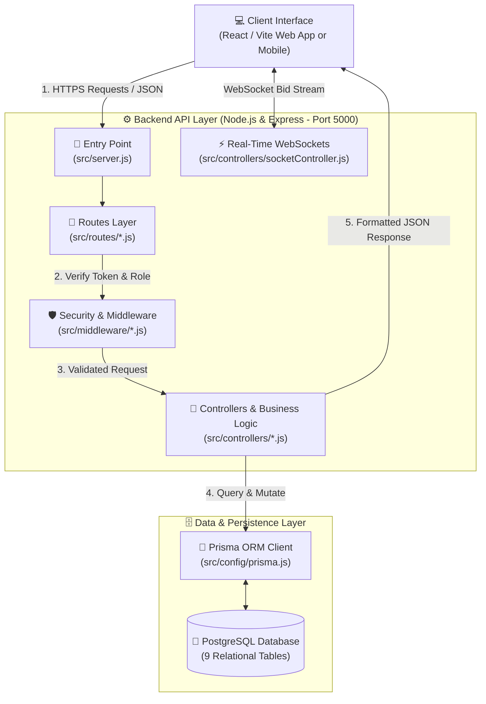
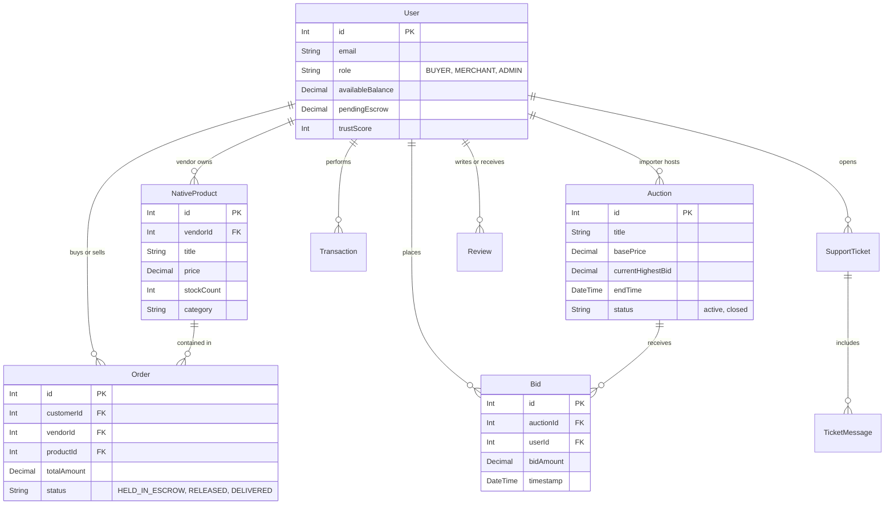
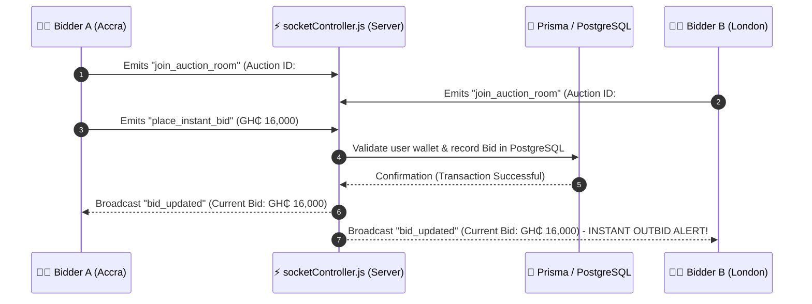

# 🏛️ TradeHub Global Exports — Backend Architecture & Technical Reference

> A comprehensive technical reference and visual architecture guide for engineers, evaluators, and proposal committees. This document demystifies the backend structure, data flow, real-time mechanics, and database engineering of the TradeHub platform in clean, intuitive terminology.

---

## Executive Summary: What Does the Backend Do?

At its core, the **TradeHub Backend** acts as the engine, bank, security guard, and real-time switchboard for the entire platform. While the frontend presents a dynamic user interface, the backend is responsible for:

1. **🔒 Security & Authentication:** Verifying who users are (Buyers, Merchants, or System Administrators) via JSON Web Tokens (JWT) and encrypted passwords.
2. **⚖️ Financial Protection (Escrow System):** Holding transaction funds in secure digital escrow (`HELD_IN_ESCROW`) until goods are verified, protecting both export merchants and overseas consumers.
3. **⚡ Real-Time Live Auctions:** Leveraging WebSockets (`Socket.IO`) to broadcast instantaneous bidding wars, price increases, and auction countdowns across the globe with zero page refreshes.
4. **🗄️ Single Source of Truth:** Coordinating all product listings, orders, wallet balances, support tickets, and review ratings within a robust PostgreSQL database managed by Prisma ORM.

---

## 🗺️ Visual Architecture & Request Flow

To understand how files communicate when a user performs an action (e.g., placing an order or bidding on an auction lot), consider the following four-tier lifecycle:



### The 5-Step Journey of a User Request:
1. **The Entry Door (`server.js`):** A request arriving from the frontend browser hits `server.js`. Here, CORS (Cross-Origin Resource Sharing) boundaries are enforced, JSON payloads are parsed, and rate-limiting rules are prepared.
2. **The Traffic Sign (`routes/`):** Based on the URL (e.g., `/api/orders`), the request is sent to the appropriate routing file (`orderRoutes.js`). The route mapping defines which internal handlers are permitted to touch this request.
3. **The Checkpoint Guards (`middleware/`):** Before reaching the database, the request must pass through our middleware guards:
   - `authMiddleware.js` inspects the user's security token and confirms their identity.
   - `adminMiddleware.js` checks if the action demands administrative clearance.
   - `validators.js` checks the data inputs to prevent SQL injections or malformed inputs.
4. **The Brain (`controllers/`):** Once cleared, the controller (e.g., `orderController.js`) performs the primary application work—calculating total cost, verifying stock levels, updating escrow ledgers, and triggering automated notification emails.
5. **The Vault Keeper (`config/` & `prisma/`):** The controller requests data through the Prisma ORM Client (`prisma.js`). Rather than writing manual, vulnerable SQL text strings, Prisma communicates directly with PostgreSQL in strongly-typed transactions, guaranteeing zero data corruption during unexpected outages.

---

## 📂 Complete Folder Structure & File Manifest

Below is the complete file breakdown of the `/backend` environment, detailed in simple, approachable terms:

```
backend/
├── 📄 package.json          # Dependency ledger (lists Node packages like express, prisma, socket.io, cors)
├── 📄 Dockerfile            # Blueprint for running the backend inside a cloud container
├── 📄 seed-products.js      # Automation script that auto-populates the store with 27 realistic test items
│
├── 📁 prisma/               # Database Architecture & Migration Engine
│   └── 📄 schema.prisma     # The master blueprint defining all database tables, columns, and relationships
│
├── 📁 scripts/              # Developer DevOps & Utility Scripts
│   ├── 📄 createAdmin.js    # CLI utility to generate privileged Super-Administrator accounts
│   └── 📄 seedTestUsers.js  # CLI utility to build sample buyers and merchant accounts for demonstrations
│
└── 📁 src/                  # Core Application Source Code
    ├── 📄 server.js         # Master server initialisation and route mounting hub
    │
    ├── 📁 config/           # Infrastructure Connection Singletons
    │   ├── 📄 db.js         # Direct database helper methods and error wrappers
    │   ├── 📄 initDb.js     # Initialization routine that primes database states during system boot
    │   └── 📄 prisma.js     # Single-instance Prisma Client that prevents connection pool exhaustion
    │
    ├── 📁 middleware/       # Gatekeepers & Request Sanitizers
    │   ├── 📄 authMiddleware.js   # Verifies JSON Web Tokens (JWT) to establish authenticated user identity
    │   ├── 📄 adminMiddleware.js  # Blocks unauthorized users from accessing sensitive administrator routes
    │   └── 📄 validators.js       # Validates email formatting, price ranges, and string lengths before processing
    │
    ├── 📁 models/           # Custom Data Queries & Entity Abstractions
    │   ├── 📄 UserModel.js        # Helper abstraction for user search and profile formatting
    │   ├── 📄 ProductModel.js     # Helper abstraction for filtering, searching, and grading product catalogs
    │   └── 📄 AuctionModel.js     # Helper abstraction for auction timing math and bidding constraints
    │
    ├── 📁 controllers/      # Business Logic & Process Executers
    │   ├── 📄 authController.js    # Manages registration, logins, password encryption, and user sessions
    │   ├── 📄 productController.js # Handles catalog listing, category filtering, search, and inventory updates
    │   ├── 📄 auctionController.js # Manages live bidding lot creation, bid placement, and auction closures
    │   ├── 📄 orderController.js   # Manages order creation, escrow fund holds, and order progress tracking
    │   ├── 📄 financeController.js # Tracks vendor wallets, MoMo withdrawals, escrow releases, and platform fees
    │   ├── 📄 userController.js    # Modifies profile settings, addresses, currencies, and notification prefs
    │   ├── 📄 socketController.js  # Directs low-latency real-time WebSockets for instant auction bid updates
    │   ├── 📄 adminController.js   # Admin dashboard metrics, dispute intervention, and platform audits
    │   ├── 📄 reviewController.js  # Processes merchant ratings, item reviews, and community trust scores
    │   ├── 📄 supportController.js # Directs customer ticketing and messaging with platform administrators
    │   └── 📄 uploadController.js  # Handles local image/document binary storage for store logos and banners
    │
    └── 📁 routes/           # URL Endpoint Descriptors (Traffic Conductors)
        ├── 📄 authRoutes.js      # Maps POST /api/auth/login and /api/auth/register
        ├── 📄 productRoutes.js   # Maps GET /api/products and POST /api/products
        ├── 📄 auctionRoutes.js   # Maps GET /api/auctions and POST /api/auctions/:id/bid
        ├── 📄 orderRoutes.js     # Maps POST /api/orders and GET /api/orders/my-orders
        ├── 📄 financeRoutes.js   # Maps GET /api/finances/wallet and POST /api/finances/withdraw
        ├── 📄 userRoutes.js      # Maps GET /api/users/profile and PATCH /api/users/profile
        ├── 📄 adminRoutes.js     # Maps administrative analytics and moderation actions
        ├── 📄 reviewRoutes.js    # Maps GET and POST reviews for merchants and products
        ├── 📄 supportRoutes.js   # Maps ticket submission and interactive chat support systems
        └── 📄 uploadRoutes.js    # Maps multipart file attachments to storage endpoints
```

---

## 🗄️ Database Schema & Relational Entity Diagram

Our Postgres database is architected around **9 core relational tables** defined within `prisma/schema.prisma`. Every table interconnects seamlessly to maintain transactional integrity:



### Key Database Tables Overview:
*   **`User` (table: `users`):** The universal profile record. Stores contact details, cryptographic hashed passwords, preferred currencies (`GHS`, `USD`), delivery addresses, store descriptions for merchants, and financial ledgers (`availableBalance`, `pendingEscrow`).
*   **`Auction` & `Bid` (tables: `auctions`, `bids`):** Power the interactive bidding arena. `Auction` stores item descriptions, expiration timestamps (`endTime`), and highest bids. `Bid` stores an immutable financial ledger of every offer submitted by users, timestamped down to the millisecond.
*   **`NativeProduct` (table: `native_products`):** The general marketplace item repository. Tracks vendor titles, prices, image URLs, categories (e.g., *Refurbished Electronics*, *Agri-Business & Spices*), and remaining inventory stock counts.
*   **`Order` & `Transaction` (tables: `orders`, `transactions`):** The transactional engine. When an order occurs, an entry is written with status `HELD_IN_ESCROW`. Once delivery is confirmed, funds shift to the vendor, logging an auditable record inside `Transaction`.
*   **`Review`, `SupportTicket`, & `FAQ`:** Support the customer service and trust ecosystem. Reviews compute automated merchant trust scores, while support tickets create organized conversation threads between buyers, sellers, and internal platform admins.

---

## ⚡ Real-Time Live Auctions Mechanics (`Socket.IO`)

Conventional HTTP APIs rely on a request-response pattern: a client asks for information, the server responds, and communication ends. This is insufficient for live auction bidding where a user needs to see another bidder jump above their offer instantly.

To accomplish real-time functionality without heavy database polling, TradeHub utilizes **Socket.IO** mounted directly within `server.js` and managed by `socketController.js`:



### Real-Time Benefits for Proposal Reviewers:
*   **Zero Refresh Latency:** As soon as a buyer clicks "Bid GH₵ +500", the server validates the ledger and pushes the new high score to every connected spectator globally within milliseconds.
*   **Low Bandwidth Overhead:** By avoiding continuous repetitive HTTP background polling, server CPU utilization remains low even during competitive bidding battles.
*   **Room Encapsulation:** Users are grouped into virtual WebSocket chat rooms based on the specific `auctionId` they are viewing, ensuring network bandwidth is conserved and broadcasts are only routed to relevant participants.

---

## 🔒 Security & Escrow Protection Summary

When evaluating the platform for corporate adoption or investment grants, three backend security features stand out:
1. **JWT Stateless Authentication:** Tokens expire automatically and prevent unauthorized session hijacking. Password hashes utilize strong cryptography that impossible to decipher even if raw DB backups are exposed.
2. **Automated Escrow Locks:** Sellers never receive buyer funds directly upon order placement. The backend dynamically intercepts capital into `pendingEscrow` ledgers, eliminating fraud, incentivizing prompt delivery, and protecting consumer trust.
3. **Prisma Single-Source Migrations:** Database migrations are strictly managed via Git-controlled schema files. This guarantees that production deployments occur smoothly without human intervention or structural database corruption.

---
*Generated by Antigravity AI — Advanced Architecture Engineering & Documentation Division.*
